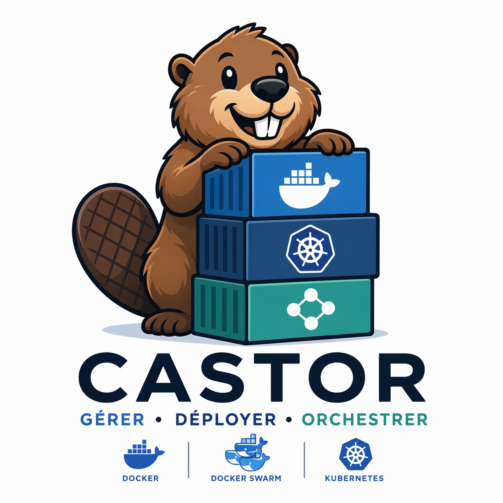
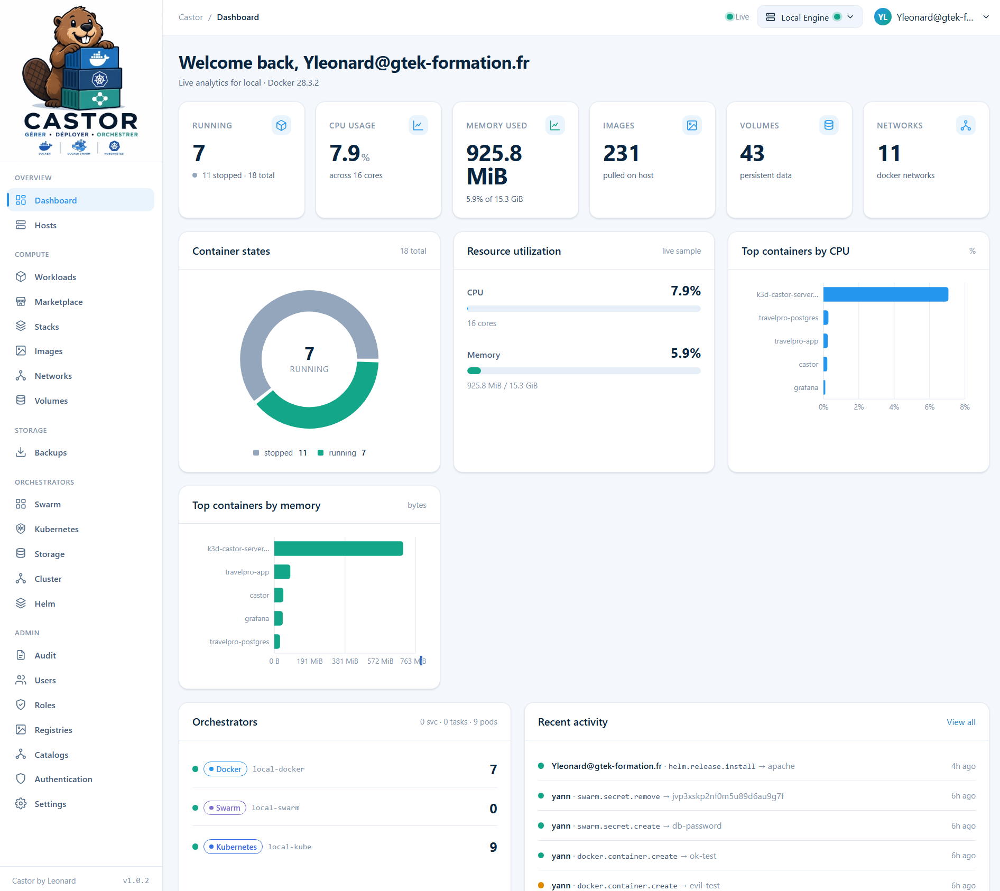

<div align="center">

<table>
  <tr>
    <td width="180" valign="top"></td>
    <td valign="top"></td>
  </tr>
</table>

# Castor

**Gérer · Déployer · Orchestrer**

Plateforme open-source et auto-hébergée d'orchestration de conteneurs — **Docker · Docker Swarm · Kubernetes** dans une seule interface moderne.

Par **IT Leonard** (LEONARD-IT / GTEK-IT) · Apache-2.0 · distribué sous forme d'une unique petite image Docker (amd64 + arm64).

<a href="README.md">🇬🇧 English</a> · 🇫🇷 **Français**

</div>

---

Castor gère vos conteneurs depuis une interface unique et moderne : Docker avec le cycle de vie
complet, les services Docker Swarm et les charges Kubernetes (Helm inclus), des statistiques en direct et un journal
d'audit en temps réel. Il tourne dans **un seul conteneur** à côté de votre moteur Docker et est
sécurisé par défaut : HTTPS, comptes locaux avec 2FA TOTP, contrôle d'accès par rôles et image
durcie non-root.

| Orchestrateur | Périmètre |
|---|---|
| **Docker** | Lecture **+ écriture** complète — liste/inspection, démarrer/arrêter/redémarrer/mettre en pause/reprendre/supprimer, logs, stats, exec, événements ; images, réseaux & volumes (création et prune) ; mise à jour d'image en un clic avec rollback automatique |
| **Docker Swarm** | Services (créer / scaler / mettre à jour / redémarrer / supprimer), nœuds (drainer / réactiver), secrets & configs |
| **Kubernetes** | Pods, deployments, statefulsets, daemonsets, jobs & cronjobs (scaler / redémarrer / supprimer / lancer), apply YAML, HPA, stockage, métriques, exec & logs, Helm (dépôts, installation / mise à jour avec aperçu / rollback) — via un kubeconfig monté |

Les agents multi-hôtes sont prévus pour la V2.

---

## ✨ Fonctionnalités

- **Détection de mises à jour d'images & mise à jour en un clic** — Castor compare le digest de l'image de chaque conteneur avec celui du registre et signale les mises à jour disponibles ; appliquez-les en un clic, avec rollback automatique si le nouveau conteneur ne démarre pas.
- **Notifications sortantes** — Discord, Slack, [ntfy](https://ntfy.sh) ou n'importe quel webhook, sur les événements *conteneur down* et *mise à jour d'image disponible*.
- **Personal Access Tokens + métriques Prometheus** — appelez l'API avec des jetons `Authorization: Bearer` et scrapez `/metrics`.
- **Entretien intégré** — pause/reprise des conteneurs, création de réseaux et de volumes, prune des images / conteneurs / volumes / réseaux depuis l'UI.
- **UX soignée** — mode sombre (Clair / Sombre / Système), une checklist d'onboarding « Getting started » et une aide contextuelle bilingue (FR/EN) sur chaque vue.

---

## ⏱️ Démarrage rapide

Requiert **Docker** (Docker Desktop sous Windows/macOS). Le chemin Compose requiert aussi **Docker Compose v2** — vérifiez avec `docker compose version`.

### Installeur en une ligne

L'installeur vérifie Docker, choisit des ports libres (HTTPS `8443`, HTTP `8080`), récupère l'image et démarre Castor.

**Linux / macOS**

```bash
curl -fsSL https://raw.githubusercontent.com/Yannleonard/Castor/main/scripts/install.sh | sh
```

**Windows (PowerShell, Docker Desktop)**

```powershell
irm https://raw.githubusercontent.com/Yannleonard/Castor/main/scripts/install.ps1 | iex
```

Les scripts sont dans [`scripts/`](scripts/) si vous préférez les lire d'abord.

### Docker run

```bash
docker run -d --name castor -p 8080:8080 -p 8443:8443 -v /var/run/docker.sock:/var/run/docker.sock:rw -v castor-data:/data --restart unless-stopped ghcr.io/yannleonard/castor:latest
```

La clé de chiffrement est générée au premier démarrage et stockée dans le volume (`/data/secret.key`) ; sauvegardez le volume. Pour fournir votre propre clé, ajoutez `-e CASTOR_SECRET_KEY=<64 hex>` (`openssl rand -hex 32`). Sur un serveur public, utilisez `-p 80:8080 -p 443:8443` et activez Let's Encrypt dans les Paramètres pour joindre Castor sur `https://votre-domaine`.

### Docker Compose

```bash
git clone https://github.com/Yannleonard/Castor.git && cd Castor
docker compose up -d
```

`CASTOR_SECRET_KEY` est optionnelle ici aussi ; un modèle `.env` est disponible dans [`deploy/env.example`](deploy/env.example).

Le fichier compose monte le socket Docker en lecture seule. Pour démarrer, arrêter, redémarrer, supprimer ou exécuter des commandes dans les conteneurs, passez le montage en `:rw` dans [`deploy/docker-compose.yml`](deploy/docker-compose.yml). Pour gérer aussi Kubernetes, ajoutez l'overlay qui monte votre kubeconfig :

```bash
docker compose -f deploy/docker-compose.yml -f deploy/docker-compose.kube.yml up -d
```

### Premier accès

Ouvrez **<https://localhost:8443>** et créez le premier compte administrateur, puis activez la **2FA TOTP**. Castor sert du HTTPS dès l'installation avec un certificat auto-signé : votre navigateur affiche donc un avertissement de certificat au premier accès. Acceptez-le une fois, ou remplacez le certificat comme décrit ci-dessous. `http://localhost:8080` redirige vers HTTPS.

---

## 🔒 HTTPS & certificats

Castor sert l'UI et l'API en HTTPS sur le port **8443**. Le port **8080** répond au healthcheck et aux challenges Let's Encrypt et redirige tout le reste vers HTTPS. Les certificats se gèrent depuis **Paramètres → HTTPS & certificats** et s'appliquent sans redémarrer le conteneur.

| Mode | Ce que vous obtenez | Quand l'utiliser |
|---|---|---|
| `self-signed` (défaut) | HTTPS avec un certificat généré par Castor | Prêt à l'emploi, LAN / labo |
| `custom` | HTTPS avec un certificat que vous importez (cert PEM + clé + chaîne) | Certificat d'une autorité publique ou interne |
| `acme` | HTTPS avec un certificat Let's Encrypt, renouvelé automatiquement | Hôte avec un nom DNS public et les ports 80/443 joignables |
| `off` | HTTP simple sur 8080, sans redirection | Derrière un reverse-proxy qui termine TLS (environnement uniquement) |

**Auto-signé (défaut).** Castor génère le certificat au premier démarrage et le stocke dans `/data/tls/`. Pour supprimer l'avertissement du navigateur, téléchargez le certificat depuis **Paramètres → HTTPS & certificats** et ajoutez-le au magasin de confiance de votre OS ou navigateur. Pour inclure le nom ou l'IP sous lequel vous joignez Castor, définissez `CASTOR_TLS_SELF_SIGNED_HOSTS=castor.lan,192.168.1.10` ; le certificat est régénéré au démarrage suivant pour les couvrir.

**Importer votre propre certificat.** Dans **Paramètres → HTTPS & certificats → Importer un certificat**, collez le certificat PEM, sa clé privée et, si elle est fournie, la chaîne intermédiaire. Castor valide la paire et bascule dessus immédiatement. Importez le certificat renouvelé de la même façon ; **Supprimer le certificat personnalisé** revient au certificat auto-signé.

**Let's Encrypt.** Requiert un nom DNS public pointant vers l'hôte et les ports **80 et 443** joignables depuis Internet, mappés sur les `8080` / `8443` de Castor (`"80:8080"` et `"443:8443"` dans le fichier compose). Dans **Paramètres → HTTPS & certificats → Let's Encrypt**, saisissez votre ou vos domaines et un e-mail de contact, puis cliquez sur **Activer Let's Encrypt**. Le certificat est émis, mis en cache dans `/data/tls/acme/` et renouvelé automatiquement ; Castor est alors joignable sur `https://votre-domaine`, sans port. Une option **staging** est disponible pour les tests.

**Derrière un reverse-proxy.** Quand Caddy, Traefik ou nginx termine TLS devant Castor, désactivez l'écoute HTTPS intégrée et ne publiez que le port 8080 vers le proxy :

```yaml
    environment:
      CASTOR_TLS_MODE: "off"
      CASTOR_TRUST_PROXY: "true"
```

Avec `CASTOR_TLS_MODE=off` défini dans l'environnement, le mode HTTPS est géré par l'environnement et ne peut pas être changé depuis l'interface.

---

## ⚙️ Configuration

| Variable | Défaut | Rôle |
|---|---|---|
| `CASTOR_SECRET_KEY` | — | Optionnelle. Clé de 32 octets en 64 caractères hex (`openssl rand -hex 32`) ; générée dans `/data/secret.key` si absente. |
| `CASTOR_HTTPS_ADDR` | `:8443` | Adresse d'écoute HTTPS (accès principal). |
| `CASTOR_HTTP_ADDR` | `:8080` | Adresse d'écoute HTTP : healthcheck, challenges ACME, redirection vers HTTPS ; seule écoute quand `CASTOR_TLS_MODE=off`. |
| `CASTOR_HTTP_REDIRECT` | `true` | Rediriger HTTP vers HTTPS (`308`) quand TLS est actif. |
| `CASTOR_TLS_MODE` | `self-signed` | `self-signed` · `custom` · `acme` · `off`. Le mode choisi dans les Paramètres prime ; `off` se définit uniquement par l'environnement. |
| `CASTOR_TLS_DIR` | `/data/tls` | Emplacement du certificat auto-signé et du cache Let's Encrypt. |
| `CASTOR_TLS_SELF_SIGNED_HOSTS` | — | Noms / IP supplémentaires (séparés par des virgules) ajoutés au certificat auto-signé. |
| `CASTOR_DB_PATH` | `/data/castor.db` | Fichier de base de données SQLite. |
| `CASTOR_DOCKER_HOST` | (socket) | Point de terminaison Docker alternatif, ex. un socket-proxy (`tcp://…`). |
| `CASTOR_KUBECONFIG` | — | Chemin vers un kubeconfig monté (défini par l'overlay Kubernetes). |
| `CASTOR_TRUST_PROXY` | `false` | Respecter `X-Forwarded-Proto` / `X-Forwarded-For` ; mettre `true` uniquement derrière un reverse-proxy de confiance, avec `CASTOR_TLS_MODE=off`. |
| `CASTOR_SELF_CONTAINER_ID` | (auto) | Identifiant du conteneur de Castor lui-même, utilisé pour l'auto-protection. |
| `CASTOR_BOOTSTRAP_TOKEN` | — | Jeton optionnel qui protège la création du premier administrateur lors d'installations automatisées. |

---

## 🔐 Sécurité

- **HTTPS par défaut**, avec certificats rechargés à chaud (auto-signé, importé ou Let's Encrypt) et HSTS avec les certificats d'autorité.
- **Comptes locaux avec 2FA TOTP** — hachage des mots de passe argon2id, secrets TOTP chiffrés au repos (AES-256-GCM).
- **Contrôle d'accès par rôles** avec les rôles intégrés `admin`, `operator` et `viewer`.
- **Personal Access Tokens** pour l'API et `/metrics`.
- **Journal d'audit complet** — chaque action mutante est enregistrée dans un journal en ajout seul.
- **Conteneurs protégés** — le conteneur de Castor lui-même et le volume `/data` ne peuvent pas être supprimés depuis l'UI ; les conteneurs étiquetés `io.castor.protected="true"` sont protégés aussi.
- **Image durcie** — distroless, exécutée en utilisateur non-root, système de fichiers racine en lecture seule, toutes les capabilities retirées, `no-new-privileges`.
- **Garde-fous CI** — `golangci-lint`, `go test -race`, vitest et `govulncheck` à chaque push.

Vue d'ensemble sécurité : [`docs/runbooks/security.md`](docs/runbooks/security.md).

---

## 🩺 Santé & mises à jour

- **Healthcheck** — `GET /api/v1/healthz` sur l'écoute HTTP ; l'image et le fichier compose embarquent une sonde `castor healthcheck`.
- **Métriques** — `GET /metrics` au format Prometheus, authentifié avec un Personal Access Token.
- **Logs** — `docker logs castor` (JSON structuré, secrets caviardés).
- **Mise à jour** — `docker compose pull && docker compose up -d`. Les données sur `/data` persistent et les migrations de schéma s'exécutent automatiquement.
- **Sauvegarde** — tout vit dans le volume `castor-data` (base de données, certificats, clé secrète). Copiez-le :
  ```bash
  docker run --rm -v castor-data:/data -v "$PWD:/backup" busybox \
    sh -c 'cd /data && tar czf /backup/castor-$(date +%Y%m%d).tgz .'
  ```

---

## 🏗️ Construire depuis les sources

L'UI et le binaire Go sont construits à l'intérieur de Docker ; seul Docker est requis sur l'hôte.

```bash
export CASTOR_SECRET_KEY=$(openssl rand -hex 32)
./build.sh build      # construit l'image pour votre architecture (Windows : ./build.ps1 build)
./build.sh run        # docker compose up -d
```

Avec un toolchain Go + Node local, `make build`, `make docker-build` et `make verify` (lint + tests) sont aussi disponibles. Les images multi-arch (`linux/amd64`, `linux/arm64`) sont publiées sur `ghcr.io/yannleonard/castor` à chaque tag `v*.*.*`.

---

## 📚 Documentation

- Installation & exploitation — [`docs/runbooks/install.md`](docs/runbooks/install.md)
- Vue d'ensemble sécurité — [`docs/runbooks/security.md`](docs/runbooks/security.md)
- Fichiers de déploiement — [`deploy/`](deploy/)
- Décisions d'architecture — [`docs/adr/`](docs/adr/)
- Contribuer — [`CONTRIBUTING.md`](CONTRIBUTING.md)

## 🤝 Contribuer

Les contributions sont les bienvenues — voir [`CONTRIBUTING.md`](CONTRIBUTING.md).

## 📄 Licence

[Apache-2.0](LICENSE) © 2026 LEONARD-IT/GTEK-IT.

Castor by IT Leonard — le nom Castor, le logo et l'attribution affichée dans l'application sont des marques ; voir [NOTICE](NOTICE) et la [politique des marques](docs/community/TRADEMARKS.md).
