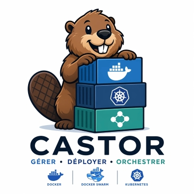

<div align="center">

🇬🇧 **English** · <a href="README.fr.md">🇫🇷 Français</a>



# Castor

**Gérer · Déployer · Orchestrer**

Open-source, self-hosted container orchestration platform — **Docker · Docker Swarm · Kubernetes** under one modern UI.

By **IT Leonard** (LEONARD-IT / GTEK-IT) · Apache-2.0 · ships as a single small Docker image (amd64 + arm64).

</div>

<p align="center">
  
</p>

---

Castor manages your containers from a single, modern interface: Docker with full lifecycle control,
Docker Swarm services and Kubernetes workloads (including Helm), live statistics and a real-time audit feed. It runs as
**one container** next to your Docker engine and is secure by default: HTTPS, local accounts with
TOTP 2FA, role-based access control and a hardened non-root image.

| Orchestrator | Scope |
|---|---|
| **Docker** | Full read **+ write** — list/inspect, start/stop/restart/pause/unpause/remove, logs, stats, exec, events; images, networks & volumes (create and prune); one-click image updates with automatic rollback |
| **Docker Swarm** | Services (create / scale / update / restart / remove), nodes (drain / activate), secrets & configs |
| **Kubernetes** | Pods, deployments, statefulsets, daemonsets, jobs & cronjobs (scale / restart / delete / run), apply YAML, HPA, storage, metrics, exec & logs, Helm (repos, install / upgrade with preview / rollback) — via a mounted kubeconfig |

Multi-host agents are planned for V2.

---

## ✨ Features

- **Image update detection & one-click updates** — Castor compares each container's image digest with its registry and flags available updates; apply them in one click, with automatic rollback if the new container fails to start.
- **Outbound notifications** — Discord, Slack, [ntfy](https://ntfy.sh) or any webhook, on *container down* and *image update available* events.
- **Personal Access Tokens + Prometheus metrics** — call the API with `Authorization: Bearer` tokens and scrape `/metrics`.
- **Housekeeping built in** — pause/unpause containers, create networks and volumes, prune images / containers / volumes / networks from the UI.
- **Polished UX** — dark mode (Light / Dark / System), a "Getting started" onboarding checklist, and bilingual (FR/EN) contextual help on every view.

---

## ⏱️ Quickstart

Requires **Docker** (Docker Desktop on Windows/macOS). The Compose path also requires **Docker Compose v2** — check with `docker compose version`.

### One-line installer

The installer checks Docker, generates and saves your secret key, picks free ports (HTTPS `8443`, HTTP `8080`), pulls the image and starts Castor.

**Linux / macOS**

```bash
curl -fsSL https://raw.githubusercontent.com/Yannleonard/Castor/main/scripts/install.sh | sh
```

**Windows (PowerShell, Docker Desktop)**

```powershell
irm https://raw.githubusercontent.com/Yannleonard/Castor/main/scripts/install.ps1 | iex
```

The scripts live in [`scripts/`](scripts/) if you prefer to read them first.

### Docker Compose

```bash
git clone https://github.com/Yannleonard/Castor.git && cd Castor
export CASTOR_SECRET_KEY=$(openssl rand -hex 32)
docker compose up -d
```

`CASTOR_SECRET_KEY` is a 32-byte key encoded as 64 hex characters. Keep it with your backups and reuse the same value whenever you recreate the container: it protects the 2FA secrets and any imported certificate. A `.env` template is available in [`deploy/env.example`](deploy/env.example).

The compose file mounts the Docker socket read-only. To start, stop, restart, remove or exec into containers, switch the mount to `:rw` in [`deploy/docker-compose.yml`](deploy/docker-compose.yml). To manage Kubernetes too, add the overlay that mounts your kubeconfig:

```bash
docker compose -f deploy/docker-compose.yml -f deploy/docker-compose.kube.yml up -d
```

### First access

Open **<https://localhost:8443>** and create the first admin account, then enable **TOTP 2FA**. Castor serves HTTPS out of the box with a self-signed certificate, so your browser shows a certificate warning on first access: accept it once, or replace the certificate as described below. `http://localhost:8080` redirects to HTTPS.

---

## 🔒 HTTPS & certificates

Castor serves the UI and the API over HTTPS on port **8443**. Port **8080** answers the healthcheck and Let's Encrypt challenges and redirects everything else to HTTPS. Certificates are managed from **Settings → HTTPS & certificates** and applied without restarting the container.

| Mode | What you get | When to use it |
|---|---|---|
| `self-signed` (default) | HTTPS with a certificate Castor generates | Out of the box, LAN / lab |
| `custom` | HTTPS with a certificate you import (PEM cert + key + chain) | Certificate from a public or internal CA |
| `acme` | HTTPS with a Let's Encrypt certificate, renewed automatically | Host with a public DNS name and ports 80/443 reachable |
| `off` | Plain HTTP on 8080, no redirect | Behind a reverse proxy that terminates TLS (environment only) |

**Self-signed (default).** Castor generates the certificate on first start and stores it under `/data/tls/`. To remove the browser warning, download the certificate from **Settings → HTTPS & certificates** and add it to your OS or browser trust store. To include the name or IP you reach Castor with, set `CASTOR_TLS_SELF_SIGNED_HOSTS=castor.lan,192.168.1.10`; the certificate is regenerated at the next start to cover them.

**Import your own certificate.** In **Settings → HTTPS & certificates → Import a certificate**, paste the PEM certificate, its private key and, if provided, the intermediate chain. Castor validates the pair and switches to it immediately. Import the renewed certificate the same way; **Remove custom certificate** returns to the self-signed certificate.

**Let's Encrypt.** Requires a public DNS name pointing at the host and ports **80 and 443** reachable from the internet, mapped to Castor's `8080` / `8443` (`"80:8080"` and `"443:8443"` in the compose file). In **Settings → HTTPS & certificates → Let's Encrypt**, enter your domain(s) and a contact e-mail, then click **Enable Let's Encrypt**. The certificate is issued, cached under `/data/tls/acme/` and renewed automatically; Castor is then reached at `https://your-domain`, without a port. A **staging** toggle is available for testing.

**Behind a reverse proxy.** When Caddy, Traefik or nginx terminates TLS in front of Castor, turn the built-in listener off and publish only port 8080 to the proxy:

```yaml
    environment:
      CASTOR_TLS_MODE: "off"
      CASTOR_TRUST_PROXY: "true"
```

With `CASTOR_TLS_MODE=off` set in the environment, the HTTPS mode is managed by the environment and cannot be changed from the UI.

---

## ⚙️ Configuration

| Variable | Default | Purpose |
|---|---|---|
| `CASTOR_SECRET_KEY` | — | **Required.** 32-byte key as 64 hex characters (`openssl rand -hex 32`). |
| `CASTOR_HTTPS_ADDR` | `:8443` | HTTPS listen address (main access). |
| `CASTOR_HTTP_ADDR` | `:8080` | HTTP listen address: healthcheck, ACME challenges, redirect to HTTPS; the only listener when `CASTOR_TLS_MODE=off`. |
| `CASTOR_HTTP_REDIRECT` | `true` | Redirect HTTP to HTTPS (`308`) when TLS is on. |
| `CASTOR_TLS_MODE` | `self-signed` | `self-signed` · `custom` · `acme` · `off`. The mode chosen in Settings takes precedence; `off` is set from the environment only. |
| `CASTOR_TLS_DIR` | `/data/tls` | Location of the self-signed certificate and the Let's Encrypt cache. |
| `CASTOR_TLS_SELF_SIGNED_HOSTS` | — | Extra names / IPs (comma-separated) added to the self-signed certificate. |
| `CASTOR_DB_PATH` | `/data/castor.db` | SQLite database file. |
| `CASTOR_DOCKER_HOST` | (socket) | Alternate Docker endpoint, e.g. a socket proxy (`tcp://…`). |
| `CASTOR_KUBECONFIG` | — | Path to a mounted kubeconfig (set by the Kubernetes overlay). |
| `CASTOR_TRUST_PROXY` | `false` | Honor `X-Forwarded-Proto` / `X-Forwarded-For`; set `true` only behind a trusted reverse proxy, with `CASTOR_TLS_MODE=off`. |
| `CASTOR_SELF_CONTAINER_ID` | (auto) | Identifier of Castor's own container, used for self-protection. |
| `CASTOR_BOOTSTRAP_TOKEN` | — | Optional token that gates the first-admin creation for unattended installs. |

---

## 🔐 Security

- **HTTPS by default**, with hot-reloaded certificates (self-signed, imported or Let's Encrypt) and HSTS with CA-issued certificates.
- **Local accounts with TOTP 2FA** — argon2id password hashing, TOTP secrets encrypted at rest (AES-256-GCM).
- **Role-based access control** with built-in `admin`, `operator` and `viewer` roles.
- **Personal Access Tokens** for the API and `/metrics`.
- **Full audit log** — every mutating action is recorded in an append-only log.
- **Protected containers** — Castor's own container and the `/data` volume cannot be removed from the UI; containers labelled `io.castor.protected="true"` are protected too.
- **Hardened image** — distroless, runs as a non-root user, read-only root filesystem, all capabilities dropped, `no-new-privileges`.
- **CI gates** — `golangci-lint`, `go test -race`, vitest and `govulncheck` on every push.

Threat model and operational guidance: [`docs/runbooks/security.md`](docs/runbooks/security.md).

---

## 🩺 Health & updates

- **Healthcheck** — `GET /api/v1/healthz` on the HTTP listener; the image and the compose file ship a `castor healthcheck` probe.
- **Metrics** — `GET /metrics` in Prometheus format, authenticated with a Personal Access Token.
- **Logs** — `docker logs castor` (structured JSON, secrets redacted).
- **Update** — `docker compose pull && docker compose up -d`. Data on `/data` persists and schema migrations run automatically.
- **Backup** — everything persistent lives in `/data` (`castor-data` volume). Copy the database:
  ```bash
  docker run --rm -v castor-data:/data -v "$PWD:/backup" busybox \
    sh -c 'cp /data/castor.db /backup/castor-$(date +%Y%m%d).db'
  ```

---

## 🏗️ Build from source

The UI and the Go binary are built inside Docker; only Docker is required on the host.

```bash
export CASTOR_SECRET_KEY=$(openssl rand -hex 32)
./build.sh build      # build the image for your architecture (Windows: ./build.ps1 build)
./build.sh run        # docker compose up -d
```

With a local Go + Node toolchain, `make build`, `make docker-build` and `make verify` (lint + tests) are also available. Multi-arch images (`linux/amd64`, `linux/arm64`) are published to `ghcr.io/yannleonard/castor` on every `v*.*.*` tag.

---

## 📚 Documentation

- Install & operations — [`docs/runbooks/install.md`](docs/runbooks/install.md)
- Security & threat model — [`docs/runbooks/security.md`](docs/runbooks/security.md)
- Deployment files — [`deploy/`](deploy/)
- Architecture decisions — [`docs/adr/`](docs/adr/)
- Contributing — [`CONTRIBUTING.md`](CONTRIBUTING.md)

## 🤝 Contributing

Contributions are welcome — see [`CONTRIBUTING.md`](CONTRIBUTING.md).

## 📄 License

[Apache-2.0](LICENSE) © 2026 LEONARD-IT/GTEK-IT.

Castor by IT Leonard — the Castor name, logo and in-app attribution are trademarks; see [NOTICE](NOTICE) and [TRADEMARKS.md](TRADEMARKS.md).
